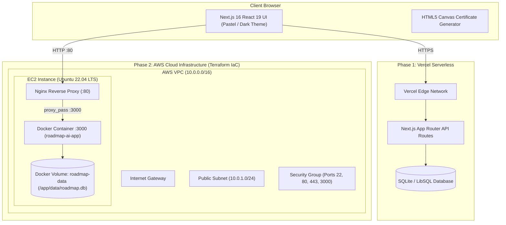
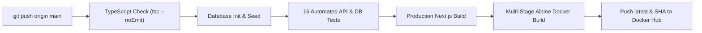

<div align="center">

# 🧭 Roadmap.ai

**Interactive Engineering Learning Platform & Hybrid Cloud DevOps Stack**

[](https://nextjs.org/)
[](https://www.typescriptlang.org/)
[](https://tailwindcss.com/)
[](https://orm.drizzle.team/)
[](https://www.docker.com/)
[](https://www.terraform.io/)
[](https://aws.amazon.com/)

[**🌐 Live Demo (Vercel)**](https://roadmap-ai-steel.vercel.app) · [**🛡️ Admin Studio**](https://roadmap-ai-steel.vercel.app/login?role=admin) · [**🎓 Learner Portal**](https://roadmap-ai-steel.vercel.app/login?role=learner)

</div>

---

## 📖 Overview

**Roadmap.ai** is a full-stack interactive engineering curriculum platform and end-to-end Cloud/DevOps reference architecture. It maps out structured, step-by-step learning trails across **6 core IT disciplines**—complete with interactive milestone nodes, concept readers, progress tracking, downloadable completion certificates, and a protected **Admin Curriculum Studio**.

The project is engineered across two production deployment phases:
- **Phase 1 (Full-Stack & Serverless)**: Next.js 16 App Router, TypeScript, Drizzle ORM + LibSQL/SQLite, JWT role-based authentication, and a custom Pastel/Dark theme engine deployed on **Vercel**.
- **Phase 2 & 2.1 (AWS Cloud IaC, Docker & CI/CD)**: Automated AWS infrastructure provisioning via **Terraform** (Custom VPC, Public Subnet, Internet Gateway, Security Groups, RSA-4096 SSH Key Pair, and EC2), running a <180MB multi-stage **Docker Compose** stack behind an **Nginx** reverse proxy with **GitHub Actions CI/CD**.

---

## ✨ Key Features

- **🗺️ 6 Interactive Whole-IT Roadmaps**:
  - **DevOps Engineering** (`/roadmap/devops`) — Linux, Git, Docker, Kubernetes, CI/CD, Terraform, Prometheus.
  - **Cloud Architecture** (`/roadmap/cloud`) — AWS Fundamentals, IAM, VPC Networking, Serverless, FinOps.
  - **Full Stack Development** (`/roadmap/fullstack`) — React/Next.js, Node.js APIs, Relational Databases, ORMs, Auth.
  - **AI & Machine Learning** (`/roadmap/ai-ml`) — Python, Linear Algebra, Scikit-Learn, Deep Learning, LLMs & RAG.
  - **Cybersecurity & Ethical Hacking** (`/roadmap/cybersecurity`) — Network Security, Cryptography, Pentesting, SOC.
  - **System Design & Architecture** (`/roadmap/system-design`) — Load Balancing, Caching, Sharding, Microservices.
- **🎨 Dual Pastel & Dark Theme Engine**: Accessible high-contrast Periwinkle, Sage, and Peach design tokens with instant theme switching.
- **🔐 Role-Based JWT Authentication (`jose` + `bcryptjs`)**:
  - **Learner Portal (`/dashboard`)**: Track completed topics, view active trail metrics, and resume milestones.
  - **Admin Curriculum Studio (`/admin`)**: Create or delete subjects, sequential milestones, and topics in real time.
- **🎓 Verified Track Completion Certificates**: Instant HTML5 Canvas high-resolution PNG certificate generator with unique credential IDs and one-click LinkedIn share text.
- **🧪 16-Check Automated Verification Suite**: Validates seeded users, bcrypt password hashes, sequential milestones, curated documentation links, and learner progress persistence.

---

## 🏗️ System Architecture

### Phase 1 & Phase 2 Hybrid Cloud Topology



### Phase 2.1 CI/CD Pipeline (`.github/workflows/ci.yml`)



---

## 📌 Application & API Endpoints

### Frontend Web Routes
| Route | Access | Description |
| :--- | :--- | :--- |
| `/` | Public | Landing page, Whole-IT tracks directory, and interactive preview. |
| `/login` | Public | Unified Sign-In portal with **Learner** and **Admin Studio** tabs (`?role=admin`). |
| `/register` | Public | Account registration with automatic role assignment and studio routing. |
| `/dashboard` | Learner / Admin | Personal progress dashboard, pastel stat cards, and **Certificate** generator. |
| `/admin` | Admin Only | Protected **Admin Studio** to create/manage subjects, milestones, and topics. |
| `/roadmap/[slug]` | Authenticated | Interactive horizontal milestone trail, concept reader, and certificate claim. |

### Backend REST API Endpoints
| Method | Endpoint | Description |
| :--- | :--- | :--- |
| `POST` | `/api/auth/login` | Authenticates user, auto-provisions first-time accounts, sets `roadmap_token` JWT cookie. |
| `POST` | `/api/auth/register` | Creates new Learner or Admin account with `bcryptjs` password hashing. |
| `GET` | `/api/auth/me` | Verifies active JWT cookie and returns session payload. |
| `POST` | `/api/auth/logout` | Clears session cookie. |
| `GET` | `/api/subjects` | Returns all learning tracks enriched with user completion percentages. |
| `GET` | `/api/roadmaps/[slug]` | Returns subject metadata, ordered milestones, topics, and user progress stats. |
| `POST` | `/api/progress` | Toggles topic completion (`completed: true | false`) for the current user. |
| `POST` / `DELETE` | `/api/admin/subjects` | Admin endpoint to create or cascade-delete a learning track. |
| `POST` / `DELETE` | `/api/admin/milestones` | Admin endpoint to add or remove sequential milestones. |
| `POST` / `DELETE` | `/api/admin/topics` | Admin endpoint to add or remove topics and documentation links. |

---

## 🚀 Getting Started (Local Development)

### 1. Clone & Install Dependencies
```bash
git clone https://github.com/Aangi-Shah1234/roadmap.ai.git
cd roadmap.ai
npm install --legacy-peer-deps
```

### 2. Initialize & Seed the Database
```bash
npm run db:seed
```

### 3. Run the Development Server
```bash
npm run dev
```
Open [http://localhost:3000](http://localhost:3000) in your browser.

### 4. Run Typecheck & Automated Tests
```bash
npm run typecheck
npm test
```

---

## 🐳 Docker Compose Deployment

Build and run the production standalone container locally or on any Linux host:

```bash
docker compose up --build -d
```
- Application runs at `http://localhost:3000`
- Persistent SQLite database is stored in the `roadmap-data` volume mounted at `/app/data/roadmap.db`.

---

## ☁️ AWS Cloud Deployment with Terraform (Phase 2)

All Infrastructure as Code files are located in [`terraform/`](./terraform):
- **`terraform/main.tf`**: Provisions VPC (`10.0.0.0/16`), Public Subnet, Internet Gateway, Route Table, Security Group (`22`, `80`, `443`, `3000`), automated RSA-4096 SSH Key Pair (`roadmap-ai-key.pem`), and an Ubuntu 22.04 EC2 instance with a `user_data` bootstrap script that installs Docker, Nginx, clones the repo, and launches `docker compose up --build -d`.

```bash
cd terraform
terraform init
terraform validate
terraform plan
terraform apply -auto-approve
```

To cleanly tear down all AWS resources and incur zero ongoing costs:
```bash
terraform destroy -auto-approve
```

---

## 🔑 Default Demo Credentials

| Role | Email | Password | Destination |
| :--- | :--- | :--- | :--- |
| **Admin Studio** | `admin@roadmap.ai` | `AdminPassword123!` | `/admin` |
| **Learner** | `learner@roadmap.ai` | `LearnerPassword123!` | `/dashboard` |
