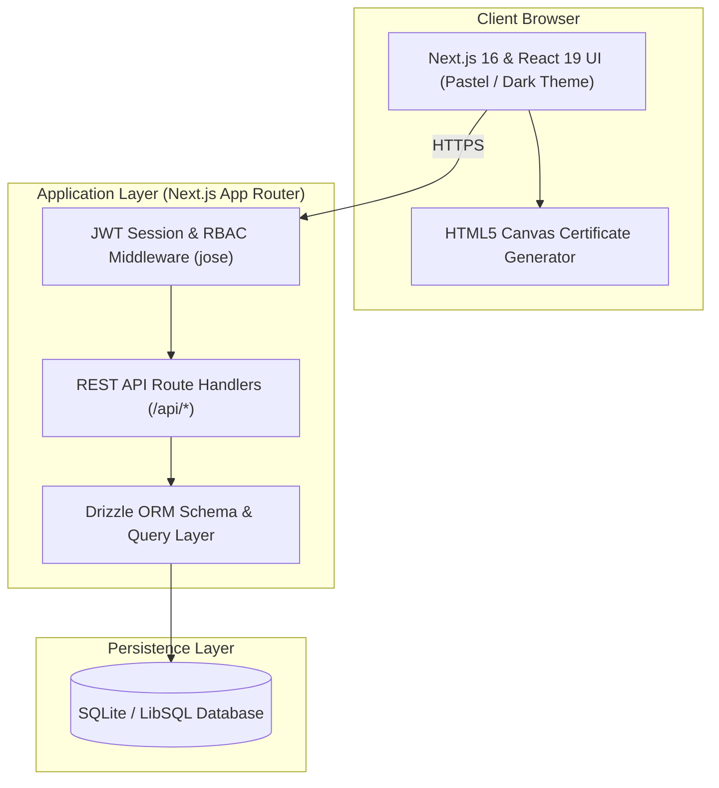
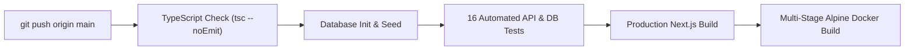

<div align="center">

# Roadmap.ai

**Interactive Engineering Learning Platform**

[](https://nextjs.org/)
[](https://www.typescriptlang.org/)
[](https://tailwindcss.com/)
[](https://orm.drizzle.team/)
[](https://www.docker.com/)

[**Live Application**](https://roadmap-ai-steel.vercel.app) · [**Admin Studio**](https://roadmap-ai-steel.vercel.app/login?role=admin) · [**Learner Portal**](https://roadmap-ai-steel.vercel.app/login?role=learner)

</div>

---

## Overview

**Roadmap.ai** is a full-stack interactive engineering curriculum platform built with Next.js 16, TypeScript, Tailwind CSS v4, and Drizzle ORM (LibSQL/SQLite). It provides structured, step-by-step learning pathways across core IT disciplines—complete with interactive milestone trails, in-depth concept readers, real-time progress tracking, verified completion certificates, and a role-protected **Admin Curriculum Studio**.

---

## Key Features

- **Interactive Engineering Roadmaps**:
  - **DevOps Engineering** (`/roadmap/devops`) — Linux, Git, Docker, Kubernetes, CI/CD, Terraform, Prometheus.
  - **Cloud Architecture** (`/roadmap/cloud`) — AWS Fundamentals, IAM, VPC Networking, Serverless, FinOps.
  - **Full Stack Development** (`/roadmap/fullstack`) — React/Next.js, Node.js APIs, Relational Databases, ORMs, Auth.
  - **AI & Machine Learning** (`/roadmap/ai-ml`) — Python, Linear Algebra, Scikit-Learn, Deep Learning, LLMs & RAG.
  - **Cybersecurity & Ethical Hacking** (`/roadmap/cybersecurity`) — Network Security, Cryptography, Pentesting, SOC.
  - **System Design & Architecture** (`/roadmap/system-design`) — Load Balancing, Caching, Sharding, Microservices.
- **Dual Pastel & Dark Theme Engine**: High-contrast Periwinkle, Sage, and Peach design tokens with instant theme toggling.
- **Role-Based JWT Authentication (`jose` + `bcryptjs`)**:
  - **Learner Portal (`/dashboard`)**: Track completed topics, monitor active trail metrics, and resume milestones.
  - **Admin Curriculum Studio (`/admin`)**: Create, manage, or delete subjects, sequential milestones, and topics in real time.
- **Verified Track Completion Certificates**: HTML5 Canvas high-resolution PNG certificate generator with deterministic credential IDs, unlocked exclusively upon 100% pathway completion.
- **Automated Verification & CI/CD**: 16-check automated test suite and GitHub Actions workflow verifying TypeScript types, database seeding, API integrity, production Next.js builds, and multi-stage Docker images on every push.

---

## System Architecture



### Continuous Integration Pipeline (`.github/workflows/ci.yml`)



---

## Application & API Endpoints

### Frontend Web Routes
| Route | Access | Description |
| :--- | :--- | :--- |
| `/` | Public | Landing page, IT tracks directory, and interactive curriculum preview. |
| `/login` | Public | Unified Sign-In portal with **Learner** and **Admin Studio** tabs (`?role=admin`). |
| `/register` | Public | Account registration with role selection and automatic studio routing. |
| `/dashboard` | Learner / Admin | Personal progress dashboard, completion statistics, and certificate claim (at 100%). |
| `/admin` | Admin Only | Protected **Admin Studio** to create and manage subjects, milestones, and topics. |
| `/roadmap/[slug]` | Authenticated | Interactive horizontal milestone trail, concept reader, and topic progress toggle. |

### Backend REST API Endpoints
| Method | Endpoint | Description |
| :--- | :--- | :--- |
| `POST` | `/api/auth/login` | Authenticates user, provisions first-time accounts, and sets `roadmap_token` HTTP-only JWT cookie. |
| `POST` | `/api/auth/register` | Creates a new Learner or Admin account with `bcryptjs` password hashing. |
| `GET` | `/api/auth/me` | Verifies active JWT cookie and returns current session payload. |
| `POST` | `/api/auth/logout` | Clears active session cookie. |
| `GET` | `/api/subjects` | Returns all learning tracks enriched with user completion counts and percentages. |
| `GET` | `/api/roadmaps/[slug]` | Returns subject metadata, ordered milestones, topics, and user progress statistics. |
| `POST` | `/api/progress` | Toggles topic completion (`completed: true | false`) for the authenticated user. |
| `POST` / `DELETE` | `/api/admin/subjects` | Admin endpoint to create or cascade-delete a learning track. |
| `POST` / `DELETE` | `/api/admin/milestones` | Admin endpoint to add or remove sequential milestones. |
| `POST` / `DELETE` | `/api/admin/topics` | Admin endpoint to add or remove topics and documentation links. |

---

## Getting Started (Local Development)

### 1. Clone & Install Dependencies
```bash
git clone https://github.com/Aangi-Shah1234/roadmap.ai.git
cd roadmap.ai
npm install --legacy-peer-deps
```

### 2. Initialize & Seed the Database
```bash
npm run db:seed
```

### 3. Run the Development Server
```bash
npm run dev
```
Open [http://localhost:3000](http://localhost:3000) in your browser.

### 4. Run Typecheck & Automated Tests
```bash
npm run typecheck
npm test
```

---

## Docker Deployment

Build and run the standalone production container locally or on any Linux server:

```bash
docker compose up --build -d
```
- Application listens on `http://localhost:3000`
- Persistent SQLite database is stored in the `roadmap-data` volume mounted at `/app/data/roadmap.db`.
